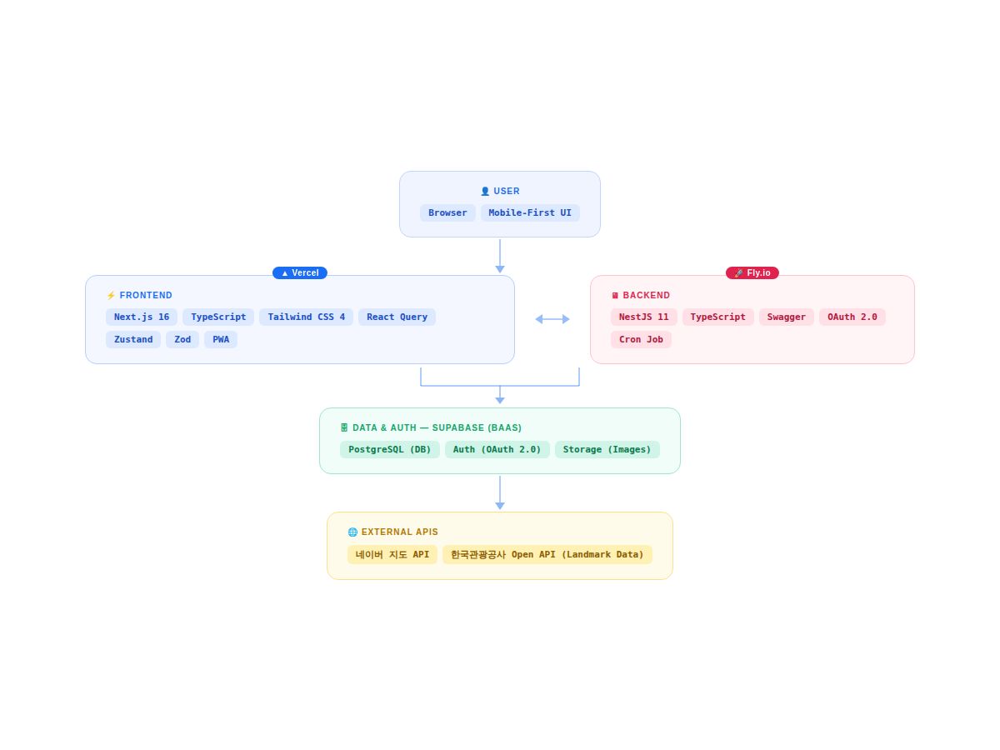

<div align="center">

<h1>
  
  <span style="vertical-align: middle;">Walkavel (워커블) — Backend</span>
</h1>

<p><b>일상이 여행이 되는 순간, 발걸음이 즐거운 여행을 제안합니다.</b></p>

<p>걷기 좋은 여행지를 발견하고 스탬프 미션을 통해 재미를 더해주는 모바일 최적화 웹 서비스.</p>

<p>
  <a href="https://walkavel.vercel.app/"></a>
  <a href="https://drive.google.com/drive/u/0/folders/16cbmrRNOPyO_16IaLjRC9ilSsMod0N-k"></a>
  <a href="https://youtu.be/BHgrptiKOFI"></a>
  <a href="https://teamwalkerbackend.fly.dev/docs"></a>
</p>

<br/>


</div>

---

## 📑 목차 <!-- omit in toc -->

- [✨ 서비스 소개](#-서비스-소개)
- [🏗️ 시스템 아키텍처](#️-시스템-아키텍처)
- [👥 BE 담당](#-be-담당)
- [🛠️ 기술 스택](#️-기술-스택)
  - [🤔 기술적 의사결정](#-기술적-의사결정)
- [📂 프로젝트 구조](#-프로젝트-구조)
- [🚀 시작하기](#-시작하기)
- [🤝 협업 가이드](#-협업-가이드)

---

## ✨ 서비스 소개


### 💡 주요 기능 (Features) <!-- omit in toc -->

#### 📍 걷기 좋은 여행지 추천 (Explore) <!-- omit in toc -->

- 동 이름으로 검색하면 주변 랜드마크를 카드 스와이프로 하나씩 탐색하고, 지도로 위치를 한눈에 확인할 수 있습니다.

#### 🎫 스탬프 획득 미션 (Stamp) <!-- omit in toc -->

- 랜드마크에 실제로 방문하면 스탬프가 자동으로 기록되고 진동 피드백으로 획득을 알려줍니다. 여행지를 직접 발로 걸으며 수집하는 재미를 더해줍니다.

#### 🔖 나만의 여행 보관함 (Bookmark) <!-- omit in toc -->

- 마음에 드는 장소를 저장해두고 언제든 꺼내볼 수 있습니다. 다음 여행 계획을 미리 모아두기에도 좋습니다.

#### 🎨 모바일 최적화 UI/UX <!-- omit in toc -->

- 앱 설치 없이 홈 화면에 추가해 네이티브 앱처럼 사용할 수 있습니다. 네트워크가 불안정한 환경에서도 동작합니다.

---

## 🏗️ 시스템 아키텍처



| Layer                      | Role                                                                 |
| :------------------------- | :------------------------------------------------------------------- |
| **Frontend** (Vercel)      | Next.js 16 기반 모바일 최적화 웹앱                                   |
| **Backend** (Fly.io)       | NestJS 11 기반 REST API 서버. 인증, 스탬프, 북마크, 여행 데이터 제공 |
| **Data & Auth** (Supabase) | PostgreSQL DB · OAuth 2.0 인증 · Storage 통합 관리                   |
| **External APIs**          | 네이버 지도 API · 한국관광공사 Open API (랜드마크 데이터)            |

---

## 👥 BE 담당

<table>
  <tr>
    <td align="center">
      <a href="https://github.com/jsyoon27">
        
      </a>
    </td>
    <td align="center">
      <b>정성윤</b><br /><br />
      🧑‍💻 부팀장<br />BE
    </td>
    <td>
      • DB 초기 설정 및 OpenAPI 테스트<br />
      • 지역별·상세 랜드마크 조회 API 구현<br />
      • 상세 페이지 조회 API 스탬프 획득 여부 판별 로직 구현<br />
      • OptionalAuthGuard로 비로그인 예외 처리<br />
      • 스탬프 테이블 생성
    </td>
  </tr>
  <tr>
    <td align="center">
      <a href="https://github.com/JHParrrk">
        
      </a>
    </td>
    <td align="center">
      <b>박준하</b><br /><br />
      🧑‍💻 팀원<br />BE · Infra
    </td>
    <td>
      • Open API 데이터 동기화 시스템 및 Landmark Mapper 구현<br />
      • DB 스키마 설계 및 TypeScript 타입 시스템 정비<br />
      • 스탬프 생성 로직 개발 및 서버 배포 설정<br />
      • 북마크 API 구현<br />
      • fly.io CORS 오리진 환경변수 처리 및 설정<br />
      • 테이블 통합 및 DB 업데이트 코드 리팩토링
    </td>
  </tr>
  <tr>
    <td align="center">
      <a href="https://github.com/YOJIN003">
        
      </a>
    </td>
    <td align="center">
      <b>정여진</b><br /><br />
      🧑‍💻 팀원<br />BE
    </td>
    <td>
      • Supabase 인증 토큰 검증 및 JWT 연동<br />
      • 사용자 프로필·마이페이지 스탬프 요약 API 구현<br />
      • 소셜 인증 보완 및 사용자 데이터 무결성 검증<br />
      • 서비스 데이터 전수 검사 및 DB 관계 설정 보완
    </td>
  </tr>
</table>

---

## 🛠️ 기술 스택

| Category              | Technology                         |
| :-------------------- | :--------------------------------- |
| **Framework**         | NestJS 11                          |
| **Language**          | TypeScript 5                       |
| **Database & Auth**   | Supabase (PostgreSQL, OAuth 2.0)   |
| **API Documentation** | Swagger (OpenAPI)                  |
| **Validation**        | class-validator, class-transformer |
| **Scheduler**         | @nestjs/schedule (Cron Job)        |
| **HTTP Client**       | @nestjs/axios                      |
| **Package Manager**   | pnpm 8                             |
| **CI/CD**             | GitHub Actions                     |
| **Git Hooks**         | Husky, Commitlint, lint-staged     |

### 🤔 기술적 의사결정

> 🚧 추가 예정

---

## 📂 프로젝트 구조

```bash
├── .github/          # GitHub Actions, PR/Issue Templates
├── db/               # 데이터베이스 스키마 및 마이그레이션 SQL
├── src/
│   ├── auth/         # 인증 도메인 (Guards, JWT, OAuth 콜백)
│   ├── bookmark/     # 북마크 도메인 (CRUD)
│   ├── tour/         # 랜드마크·스탬프 도메인 (한국관광공사 API Sync, Cron Job)
│   ├── user/         # 사용자·스탬프 현황 도메인
│   ├── supabase/     # Supabase 클라이언트 설정
│   ├── common/       # 공통 DTO·상수 (PostgreSQL 에러 코드 등)
│   ├── utils/        # 공통 유틸리티 (Error handling)
│   ├── database.types.ts  # Supabase DB 타입 정의
│   ├── setup-swagger.ts   # Swagger 설정
│   ├── app.module.ts      # Root module
│   └── main.ts            # Entry point
└── test/             # E2E tests
```

---

## 🚀 시작하기

### 1. 패키지 설치 <!-- omit in toc -->

Node.js 20.0.0 이상, pnpm 8.x 이상이 필요합니다.

```bash
pnpm install
```

### 2. 환경 변수 설정 <!-- omit in toc -->

`.env.example` 파일을 `.env`로 복사한 후 값을 설정합니다.

```bash
cp .env.example .env
```

### 3. 개발 서버 실행 <!-- omit in toc -->

```bash
pnpm start:dev
```

API 문서는 [http://localhost:3001/docs](http://localhost:3001/docs)에서 확인할 수 있습니다.

---

## 🤝 협업 가이드

협업 문화와 코드 작성 규칙에 대한 상세 내용은 [COLLABORATION.md](docs/COLLABORATION.md) 및 [💻 Team Notion](https://www.notion.so/hayeonbaek/2fdf2cf9d94180f488aef3da85e6e993?source=copy_link)에서 확인할 수 있습니다.

- **브랜치 전략**: Git Flow 기반 형상 관리
- **커밋 컨벤션**: Conventional Commits 준수로 히스토리 가시성 확보
- **코드 리뷰**: Gemini AI 1차 리뷰 후 모든 병합(feat→develop, develop→main)에 최소 1인 팀원 승인 필수
- **품질 관리**: GitHub Actions 기반 CI/CD로 모든 PR에 빌드·린트·테스트 자동 검증
